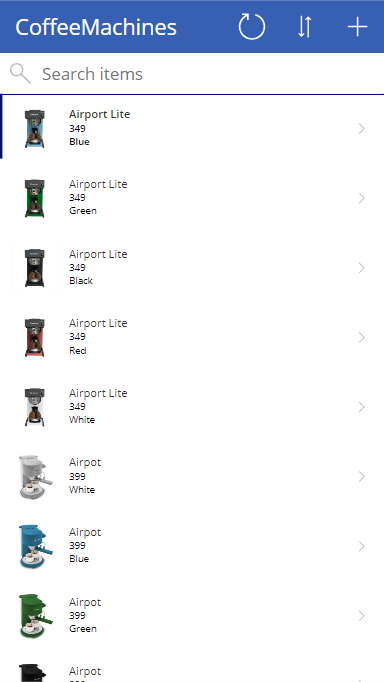

---
lab:
    title: 'Lab 1: Create a canvas app from data'
    module: 'Module 1: Get started with Power Apps canvas apps'
---

# Practice Lab 1 – Create a canvas app from data

In this lab you will design and build a canvas app from an existing data source.

## What you will learn

- How to create Power Apps canvas apps from data and with CoPilot
- How to connect to Excel using OneDrive for Business as a data source

## High-level lab steps

- Create a three screen canvas app
- Test the app
- Create a canvas app with CoPilot
  
## Prerequisites

- Must have completed **Lab 0: Validate lab environment**

## Detailed steps

## Exercise 1 – Get the data

### Task 1.1 - Download the Excel spreadsheet

1. Navigate to [CoffeeMachineData.xlsx](https://github.com/MicrosoftDocs/mslearn-developer-tools-power-platform/blob/master/power-apps/coffee-machine-data/CoffeeMachineData.xlsx).

1. Select the **Raw** file button to download the Excel workbook.

    

### Task 1.2 Upload to OneDrive for Business

1. In the [Power Apps maker portal](https://make.powerapps.com) select the **App launcher** in the top left of the browser window and then select **OneDrive**.

    

1. If presented with a pop-up, select **Your OneDrive is ready**.

1. Select **+ Add new** and then select **Files upload**

    

1. Browse to Downloads and select the CoffeeMachineData.xlsx file and select **Open**.

1. Select **My files** and verify that CoffeeMachineData.xlsx has been uploaded.

## Exercise 2 – Build a three-screen canvas app

### Task 2.1 - Create the app

1. Navigate to the Power Apps Maker portal <https://make.powerapps.com>.

1. Make sure you are in the **Dev One** environment.

1. Select the **+ Create** tab from the left-side menu.

1. Select the **Excel** tile under **Start from**.

    

1. Select **+ New connection**

1. Select  **OneDrive for Business**, select **Create**, sign in with your tenant credentials, and select **Allow access**.

1. Under Choose an Excel file, find and select the **CoffeeMachineData.xlsx** Excel file.

1. Under Choose a table, select **CoffeeMachines**.

1. Select **Connect**.

1. If the **Welcome to Power Apps Studio** pop-up dialog is displayed, select **Don't show me this again** and select **Skip**.

1. Wait for the app to be built.

    

1. Select **Save** in the top-right of the Power Apps Studio, enter `Coffee Machines App`, and select **Save**.

### Task 2.2 - Test the app

1. Select the **Preview the app** icon in the top-right of the Power Apps Studio.

1. Select any machine in the gallery. This navigates to the Detail screen,

1. Select the **Edit** icon at the top right of the app. This opens the Edit screen.

1. Change the **Machine Price** and select the **Submit item** tick icon at the top right of the app.

1. Select the **<** icon at the top left of the app.

1. Select the **+** icon at the top right of the app.

1. Enter `97` for **Machine ID**.

1. Enter `Demo Machine` for **Machine Name**.

1. Enter `999` for **Machine Price**.

1. Select the **Submit item** icon at the top right of the app.

1. Enter `Demo` in  **Search items**.

1. Select **X** in the upper right corner to stop the preview.

1. If the **Did you know?** pop-up dialog is displayed, select **Don't show me this again** and select **Ok**.

1. Select the **<- Back** button from the top left of the command bar, and select **Leave** to exit the app.

## Exercise 3 – Build a canvas app with Copilot

### Task 3.1 - Create the app

1. Navigate to the Power Apps Maker portal `https://make.powerapps.com`

1. Make sure you are in the **Dev One** environment.

1. Select the **Home** tab from the left navigation menu. 

   > If **Try the new Power Apps experience** toggle is enabled, please disable it for this lab to function properly.
   > We will be launching new labs soon with the updated experience.

1. Under **Let's build an app. What should it do?** enter `Assign coffee repairs to technicians per customer request` and select the **Go** arrow icon to submit.

    

    Copilot will begin to build a table structure to support your application.

    > **IMPORTANT:** 
    > When using generative AI, you will not always get the same exact results. It is possible that your table will not exactly match the table created for another student. 

    > To see the table structure, select the table and click on **View data** button 
1. Review the table

    

1. Once you are happy with your table, select the **Save and open app** button. 

1. If necessary, On the **Done working?** screen, select **Don’t ask me again**, and select the **Save and open app** button. 

1. Wait for the app to be built.

    

1. Select **Save** in the top-right of the Power Apps Studio.

1. Select the **<- Back** button from the top left of the command bar, and select **Leave** to exit the app.

1. Select the **Apps** tab from the left-side menu of the Power Apps maker portal.
