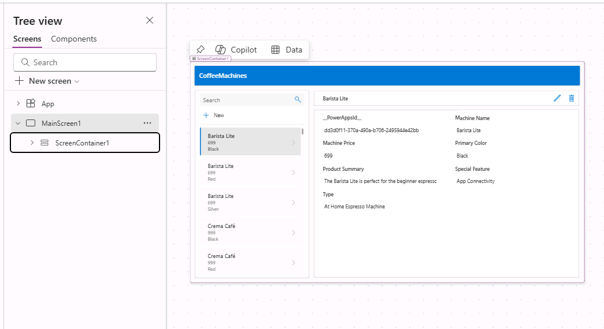

---
lab:
    title: 'Lab 1: Create a canvas app from data'
    module: 'Module 1: Get started with Power Apps canvas apps'
---

# Practice Lab 1 – Create a canvas app from data

In this lab you will design and build a canvas app from an existing data source.

## What you will learn

- How to create Power Apps canvas apps from data and with CoPilot
- How to connect to Excel using OneDrive for Business as a data source

## High-level lab steps

- Create a canvas app from data
- Test the app
- Create a canvas app with CoPilot
  
## Prerequisites

- Must have completed **Lab 0: Validate lab environment**

## Detailed steps

## Exercise 1 – Get the data

### Task 1.1 - Download the Excel spreadsheet

1. In a web browser, navigate to [CoffeeMachineData.xlsx](https://github.com/MicrosoftLearning/PL-7001-Create-and-manage-canvas-apps-with-Power-Apps/blob/master/Allfiles/Labs/CoffeeMachineData.xlsx) at `https://github.com/MicrosoftLearning/PL-7001-Create-and-manage-canvas-apps-with-Power-Apps/blob/master/Allfiles/Labs/CoffeeMachineData.xlsx`.

1. Select the **Download** file button to download the Excel workbook.

    

### Task 1.2 Upload to OneDrive for Business

1. In the [Power Apps maker portal](https://make.powerapps.com) select the **App launcher** in the top left of the browser window and then select **OneDrive**.

    

1. If presented with a pop-up, select **Your OneDrive is ready**.

1. Select **+ Create or upload** and then select **Files upload**

    

1. Browse to the **Downloads** folder and select the **CoffeeMachineData.xlsx** file and select **Open**.

1. Select **My files** and verify that CoffeeMachineData.xlsx has been uploaded.

## Exercise 2 – Build a canvas app from data

### Task 2.1 - Create the app

1. Navigate to the Power Apps Maker portal <https://make.powerapps.com>.

1. Make sure you are in the **Dev One** environment.

1. Select the **+ Create** tab from the left-side menu.

1. Select the **Start with data** tile under **Create your apps**.

    

1. Select the **Connect external data** tile under **Other ways to get started**.

    

1. Select the **From Excel** tile under **Choose a data set to start**.

    

1. An **Excel Online (Business)** connection will automatically be created after a short delay.

1. Expand **OneDrive for Business** under **Select the table**.

1. Expand **OneDrive**.

1. Expand the **CoffeeMachineData.xlsx** Excel file.

1. Select the **CoffeeMachines** table.

    

1. Select **Create app**.

1. If the **Welcome to Power Apps Studio** pop-up dialog is displayed, select **Don't show me this again** and select **Skip**.

1. Wait for the app to be built.

    

1. Select **Save** in the top-right of the Power Apps Studio, enter `Coffee Machines App`, and select **Save**.

### Task 2.2 - Test the app

1. Select the **Preview the app (F5)** icon in the top-right of the Power Apps Studio.

1. Select any machine in the gallery. This displays details of the machine in the form.

1. Select the **Edit** icon at the top right of the app.

1. Change the **Machine Price** and select the **Tick** icon at the top right of the app.

1. Select the **+ New** icon at the top left of the app.

1. Enter `abcde` for Machine ID.

1. Enter `Demo Machine` for **Machine Name**.

1. Enter `999` for **Machine Price**.

1. Select the **Tick** icon at the top right of the app.

1. Select **X** in the upper right corner to stop the preview.

1. If the **Did you know?** pop-up dialog is displayed, select **Don't show me this again** and select **Ok**.

1. Select the **<- Back** button from the top left of the command bar, and select **Leave** to exit the app.

## Exercise 3 – Build a canvas app with Copilot

### Task 3.1 - Create the app

1. Navigate to the Power Apps Maker portal `https://make.powerapps.com`

1. Make sure you are in the **Dev One** environment.

1. Select the **+ Create** tab from the left-side menu.

1. Select the **Start with Copilot** tile under **Create your apps**.

1. Under **Get started with Copilot** enter `Assign coffee repairs to technicians per customer request`.

    

1. Select the **Table options** icon and select **One table**..

    

1. Select **Generate**.

    Copilot will begin to build a table structure to support your application.

    > **IMPORTANT:**
    > When using generative AI, you will not always get the same exact results. It is possible that your table will not exactly match the table created for another student.

1. Select the **Commands (...)** next to the table and select **View data**.

    

1. Review the table

    

1. Once you are happy with your table, select the **Save and open app** button.

1. If necessary, On the **Done working?** screen, select **Don’t ask me again**, and select the **Save and open app** button.

1. Wait for the app to be built.

    

1. Select **Save** in the top-right of the Power Apps Studio, enter `Coffee Machine Repairs App`, and select **Save**.

1. Select the **<- Back** button from the top left of the command bar, and select **Leave** to exit the app.

1. Select the **Apps** tab from the left-side menu of the Power Apps maker portal.
