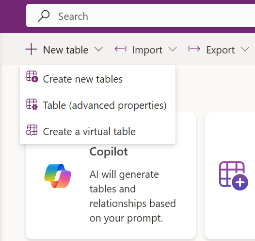
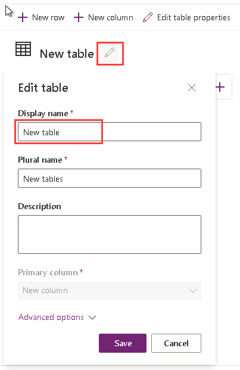
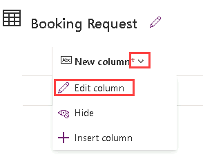
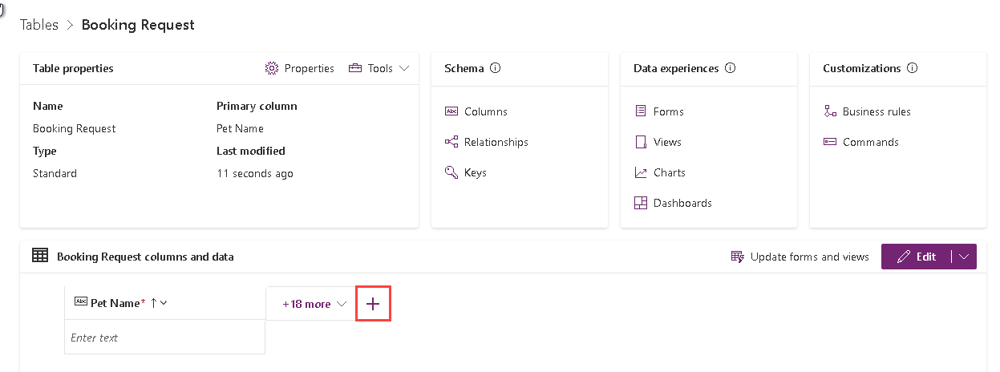
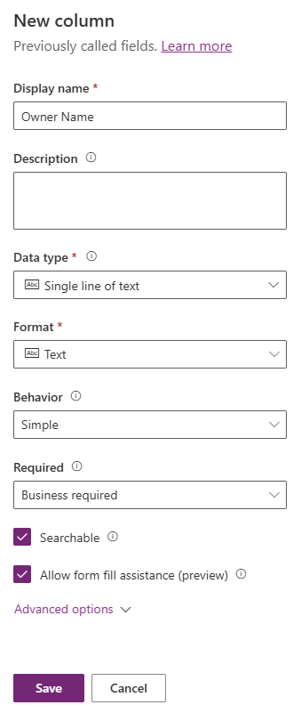
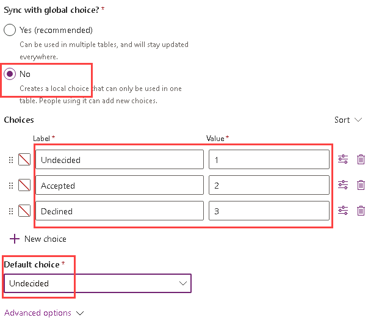
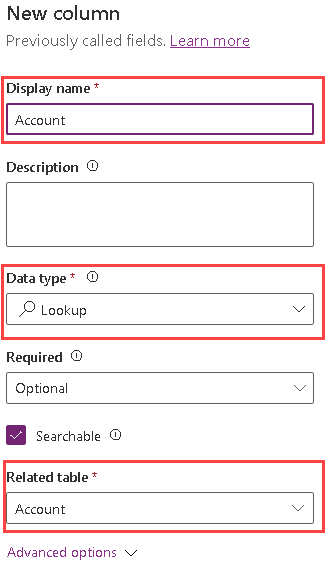

---
lab:
    title: 'Lab 2: Data model'
    module: 'Module 2: Get started with Microsoft Dataverse'
---

# Practice Lab 2 – Data model

In this lab you will create Dataverse tables and columns.

## What you will learn

- How to create tables and columns in Microsoft Dataverse
- How to create a relationship with a lookup column

## High-level lab steps

- Create a custom table
- Add columns to the table
- Create relationship to the by using a lookup column
  
## Prerequisites

- Must have completed **Lab 0: Validate lab environment**

## Detailed steps

## Exercise 1 – Create custom tables

### Task 1.1 - Create the Booking Request table

1. Navigate to the Power Apps Maker portal `https://make.powerapps.com`

1. Make sure you are in the **Dev One** environment.

1. In the left navigation pane, select **Tables**.

1. Select **+ New table**, and select **Add columns and data**.

    

1. Select the **Edit table properties** pencil icon next to **New table**.

    

1. Enter `Booking Request` for **Display name**.

1. Select **Save**.

### Task 1.2 - Primary column

1. Select the drop-down caret next to **New column** and select **Edit column**.

    

1. Enter `Pet Name` for **Display name**.

1. Select **Update**.

1. Select **Create**.

### Task 1.3 - Add columns

1. In the **Booking Request columns and data** pane, select **+** to add a new column.

    

1. In the **New column** pane, enter or select the following values:

   1. Display name: `Owner Name`
   1. Data type: **Single line of text**
   1. Required: **Business required**

    

1. Select **Save**.

1. In the **Booking Request columns and data** pane, select **+** to add a new column.

1. In the **New column** pane, enter or select the following values:

   1. Display name: `Owner Email`
   1. Data type: **Single line of text**
   1. Format: **Email**
   1. Required: **Business required**

1. Select **Save**.

1. In the **Booking Request columns and data** pane, select **+** and in the **New column** pane, enter or select the following values:

   1. Display name: `Start Date`
   1. Data type: **Date and time**
   1. Required: **Business required**

1. Select **Save**.

1. In the **Booking Request columns and data** pane, select **+** and in the **New column** pane, enter or select the following values:

   1. Display name: `End Date`
   1. Data type: **Date and time**
   1. Required: **Optional**

1. Select **Save**.

1. In the **Booking Request columns and data** pane, select **+** and in the **New column** pane, enter or select the following values:

   1. Display name: `Cost`
   1. Data type: **Currency**
   1. Required: **Optional**

1. Select **Save**.

1. In the **Booking Request columns and data** pane, select **+** and in the **New column** pane, enter or select the following values:

   1. Display name: `Notes`
   1. Data type: **Multiple lines of text**
   1. Format: **Text**
   1. Required: **Optional**

1. Select **Save**.

### Task 1.4 - Add choice column

1. In the **Booking Request columns and data** pane, select **+** and in the **New column** pane, enter or select the following values:

   1. Display name: `Decision`
   1. Data type: **Choice**
   1. Required: **Optional**

1. Select **No** for **Sync with global choice?**

1. Enter `Undecided` for **Label** and enter `1` for **Value**.

1. Select **+ New choice** and enter `Accepted` for **Label** and enter `2` for **Value**.

1. Select **+ New choice** and enter `Declined` for **Label** and enter `3` for **Value**.

1. Select **Undecided** for **Default choice**.

    

1. Select **Save**.

## Exercise 2 – Create relationship

### Task 2.1 - Create a lookup column

1. Navigate to the Power Apps Maker portal `https://make.powerapps.com`

1. Make sure you are in the **Dev One** environment.

1. In the left navigation pane, select **Tables**.

1. Select **Booking Request**.

1. In the **Booking Request columns and data** pane, select **+** and in the **New column** pane, enter or select the following values:

   1. Display name: `Account`
   1. Data type: **Lookup**
   1. Required: **Optional**
   1. Related table: **Account**

    

1. Select **Save**.

## Exercise 3 – Data

### Task 3.1 - Add booking request records

1. Navigate to the Power Apps Maker portal <https://make.powerapps.com>.

1. Make sure you are in the **Dev One** environment.

1. In the left navigation pane, select **Tables**.

1. Select **Booking Request**.

1. In the **Booking Request columns and data** pane, select the drop-down caret next to **Edit** and select **Edit in new tab**.

1. Enter or select the following values:

   1. Pet Name: `Fido`
   1. Owner Name: `MOD Administrator`
   1. Owner Email: Use your tenant email
   1. Start Date: **Tomorrow**
   1. End Date: **Pick a date in the following week**
   1. Cost: `1,000`
   1. Decision: **Accepted**

1. Select **Inset row below** and enter or select the following values:

   1. Pet Name: `Tom`
   1. Owner Name: `MOD Administrator`
   1. Owner Email: Use your tenant email
   1. Start Date: **Pick a date in the next month**
   1. End Date: **Pick a date after the start date**
   1. Cost: `1,500`
   1. Decision: **Undecided**

1. Select **Inset row below** and enter or select the following values:

   1. Pet Name: `Jim`
   1. Owner Name: `MOD Administrator`
   1. Owner Email: Use your tenant email
   1. Start Date: **Pick a future date in the current month**
   1. End Date: **Pick a date after the start date**
   1. Cost: `250`
   1. Decision: **Declined**

1. Close the edit data tab.

