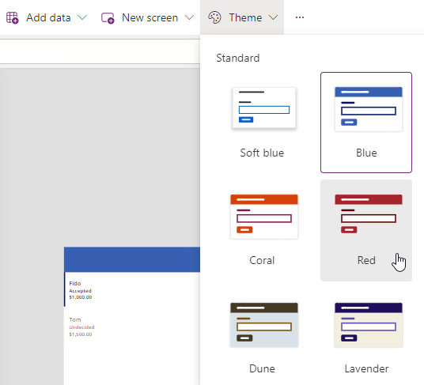

---
lab:
    title: 'Lab 4: Build the UI'
    module: 'Module 4: How to build the UI in a canvas app in Power Apps'
---

# Practice Lab 4 – Build the UI

In this module you will change the colors of the controls in the app.

## What you will learn

- How to use themes
- How to personalize your app

## High-level lab steps

- Select a theme
- Personalization
  
## Prerequisites

- Must have completed **Lab 3: Create a canvas app**

## Detailed steps

## Exercise 1 – Theme

### Task 1.1 - Edit the app

1. Navigate to the Power Apps Maker portal <https://make.powerapps.com>.

1. Make sure you are in the **Dev One** environment.

1. Select the **Apps** tab from the left-side menu.

1. Select the **Booking Request app**, select the Commands (**...**), select **Edit > Edit in new tab**.

### Task 1.2 - Select a theme

1. In action bar in the Power Apps Studio, select **Theme**.

    

1. Select the **Red** theme.

### Task 1.3 - Brand controls

1. In the app authoring menu, select **Tree view**.

1. Expand the gallery.

1. Select **NextArrow**.

1. Set the **Color** property of NextArrow to:

    ```powerappsfl
    RGBA(164, 38, 44, 1)
    ```

1. Select **Body**.

1. Set the **Color** property of Body to:

    ```powerappsfl
    If(ThisItem.Cost > 1000, RGBA(164, 38, 44, 1), Color.Black)
    ```

1. Select **Save** in the top-right of the Power Apps Studio.

## Exercise 2 – Personalization

### Task 2.1 - Add user label

1. Click outside of the gallery on the blank canvas.

1. In the app authoring menu, select **Insert (+)**.

1. Select **Text label**.

1. Drag the label to the top right of the screen.

1. In the app authoring menu, select **Tree view**.

1. Rename the label to `UserLabel`.

1. Set the properties of the label as follows:

   1. X=`1100`
   1. Y=`20`
   1. Height=`40`
   1. Width=`250`
   1. Align=`Align.Right`
   1. Size=`18`
   1. PaddingRight=`10`
   1. Color=`Color.White`
   1. Text=`User().FullName`

    

1. Select **Save** in the top-right of the Power Apps Studio.

1. Select the **<- Back** button from the top left of the command bar, and select **Leave** to exit the app.
