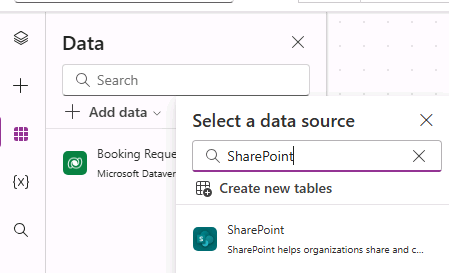
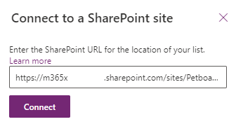

---
lab:
    title: 'Lab 5: External data'
    module: 'Module 5: Work with external data in a Power Apps canvas app'
---

# Practice Lab 5 – External data

In this module you will add an external data source.

## What you will learn

- How to add a SharePoint list to your canvas app
- How to use collections
- How to use Patch
- How to use Office365Users connector

## High-level lab steps

- Create a SharePoint list for Bookings
- Add the SharePoint list as a gallery
- Store selected records from a gallery
- Use Patch to set the decision for a booking request
- Use Office365User connector to display the user's details.
  
## Prerequisites

- Must have completed **Lab 4: Build the UI**

## Detailed steps

## Exercise 1 – Create SharePoint list

### Task 1.1 Create a SharePoint site

1. In the [Power Apps maker portal](https://make.powerapps.com) select the **App launcher** in the top left of the browser window and then select **OneDrive**.

1. In SharePoint, select **+Create site**.

1. Select **Team site**, select **Standard team** template, and select **Use template**.

1. Enter `Pet boarding` for **Site name** and select **Next**.

1. Select **Create site**.

1. Select **Finish**.

### Task 1.2 Create a SharePoint list

1. In the SharePoint site, select **+ New** and then select **List**.

    

1. Select **Blank list**

1. Enter `Bookings` for **Name**  and select **Create**.

1. Select **Add column**, select **Text**, and select **Next**.

1. In the **Create a column** pane, enter or select the following values:

   1. Name: `Pet Name`
   1. Data type: **Single line of text**

1. Select **Save**.

1. Select **Add column**, select **Text**, and select **Next**.

1. In the **Create a column** pane, enter or select the following values:

   1. Name: `Owner Name`
   1. Data type: **Single line of text**

1. Select **Save**.

1. Select **Add column**, select **Date and time**, and select **Next**.

1. In the **Create a column** pane, enter or select the following values:

   1. Name: `Start Date`
   1. Data type: **Date and time**

1. Select **Save**.

1. Select **Add column**, select **Date and time**, and select **Next**.

1. In the **Create a column** pane, enter or select the following values:

   1. Name: `End Date`
   1. Data type: **Date and time**

1. Select **Save**.

1. Copy the first part of the URL of the SharePoint site, for example `https://m365x99999999.sharepoint.com/sites/Petboarding/`

## Exercise 2 – Add SharePoint list to canvas app

### Task 2.1 - Edit the app

1. Navigate to the Power Apps Maker portal <https://make.powerapps.com>.

1. Make sure you are in the **Dev One** environment.

1. Select the **Apps** tab from the left-side menu.

1. Select the **Booking Request app**, select the Commands (**...**), and select **Edit > Edit in new tab**.

### Task 2.2 - Add SharePoint as a data source

1. In the app authoring menu, select **Data**.

1. Select the drop-down caret next to **Add data** and enter `SharePoint` in **Search**.

    

1. Select **SharePoint**.

1. Select **Connect directly (cloud services)** and select **Connect**.

1. Enter the URL of the SharePoint site you created earlier in this lab

    

1. Select **Connect**.

1. Select **Bookings**.

    

1. Select **Connect**.

### Task 2.3 - Add gallery for SharePoint list

1. In the app authoring menu, select **Insert (+)**.

1. Select **Vertical gallery**.

1. Select **Bookings** for data source.

1. Select **Title and subtitle** for **Layout**.

1. Select **6 selected** next to **Fields**

1. Select **Decision** for **Title**.

1. Select **Start Date** for **Subtitle**.

1. Close the Data pane.

1. In the app authoring menu, select **Tree view**.

1. Rename the gallery to `BookingList`.

1. Set the properties of the gallery as follows:

   1. X=`1000`
   1. Y=`80`
   1. Height=`575`
   1. Width=`250`

## Exercise 3 – Collections

### Task 3.1 Create Collection

1. In the app authoring menu, select **Tree view**.

1. Expand **BookingRequestList**.

1. Select **NextArrow**.

1. Set the **OnSelect** property of NextArrow to:

    ```powerappsfl
    Collect(colRequests, ThisItem)
    ```

1. In the app authoring menu, select **Tree view**.

1. Select the **App** object.

1. Set the **OnStart** property of NextArrow to:

    ```powerappsfl
    Clear(colRequests)
    ```

## Exercise 4 – Patch

### Task 4.1 Decline booking request

1. In the app authoring menu, select **Tree view**.

1. Select **BookingRequestList**.

1. Select the **pencil** icon in the top-left of the gallery control.

    

1. In the app authoring menu, select **Insert (+)**.

1. Expand **Icons**.

1. Select **Blocked**. The icon will be added to each row in the gallery.

    

1. Set the properties of the icon as follows:

   1. X=`150`
   1. Y=`40`
   1. Height=`30`
   1. Width=`30`

1. In the app authoring menu, select **Tree view**.

1. Rename the icon to `DeclineIcon`.

1. Set the **OnSelect** property of **DeclineIcon** to:

    ```powerappsfl
    Patch('Booking Requests', ThisItem, {Decision: 'Decision (Booking Requests)'.Declined})
    ```

## Exercise 5 – Office 365 Users

### Task 5.1 Add Office 365 Users as a data source

1. In the app authoring menu, select **Data**.

1. Select the drop-down caret next to **Add data** and enter `Office 365` in **Search**.

1. Select **Office 365 Users**.

1. Select **Connect**.

### Task 5.2 Display the user's country

1. Click outside of the gallery on the blank canvas.

1. In the app authoring menu, select **Insert (+)**.

1. Select **Text label**.

1. Drag the label to the top right of the screen next to the UserLabel.

1. In the app authoring menu, select **Tree view**.

1. Rename the label to `UserDetailsLabel`.

1. Set the **OnSelect** property of **UserDetailsLabel** to:

    ```powerappsfl
    Office365Users.MyProfile().Country
    ```

1. Select **Save** in the top-right of the Power Apps Studio.

1. Select the **<- Back** button from the top left of the command bar, and select **Leave** to exit the app.
