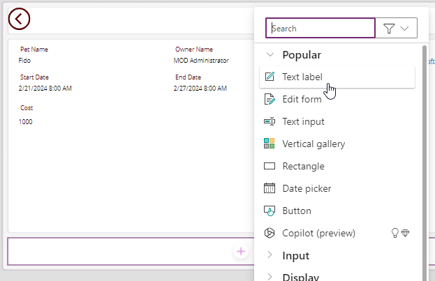

---
lab:
    title: 'Lab 6: Forms'
    module: 'Module 6: Write data in a Power Apps canvas app'
---

# Practice Lab 6 – Forms

In this lab you will use forms to create and edit records in a data source.

## What you will learn

- How to add screens
- How to navigate between screens
- How to use a form to create a record in a data source
- How to use a form to edit a record in a data source
- How to delete a record from a data source
- How to link a form to a gallery

## High-level lab steps

- Create new screens
- Navigate to a screen when a record is selected in a gallery
- Navigate between screens
- Display a record with a form
- Delete a record
- Edit a record with a form
- Create a new record with a form
  
## Prerequisites

- Must have completed **Lab 5: External data**

## Detailed steps

## Exercise 1 – Add screens and navigation

### Task 1.1 - Edit the app

1. Navigate to the Power Apps Maker portal `https://make.powerapps.com`

1. Make sure you are in the **Dev One** environment.

1. Select the **Apps** tab from the left navigation menu.

1. Select the **Booking Request app**, select the Commands (**...**), and select **Edit > Edit in new tab**.

### Task 1.2 - Add screens

1. In the app authoring menu, select **Tree view**.

1. At the top of the Tree view, select **+ New screen**.

    

1. Select **Blank**.

1. Rename the screen to `EditScreen`.

1. At the top of the Tree view, select **+ New screen**.

1. Select **Header and footer**.

1. Rename the screen to `DetailScreen`.

### Task 1.3 - Add navigation

1. In the **Tree view**, expand **BookingRequestList** in the **MainScreen**.

1. Select **NextArrow** in **BookingRequestList**.

1. Set the **OnSelect** property of NextArrow in the formula bar to:

    ```powerappsfl
    Collect(colRequests, ThisItem);Navigate(DetailScreen, ScreenTransition.Cover);
    ```

1. Select **EditScreen**.

1. In the app authoring menu, select **Insert (+)**.

1. Expand **Icons**.

1. Select **Back arrow**.

1. Set the **OnSelect** property of the icon to:

    ```powerappsfl
    Back()
    ```

1. Rename the icon to `BackIconEdit`.

1. In the **Tree view**, select the icon and select the Commands (**...**) and select **Copy**.

1. Expand **DetailScreen**.

1. Expand **ScreenContainer**.

1. Select **HeaderContainer** and select the Commands (**...**) and select **Paste** and select **Paste**.

1. Rename the icon to `BackIconDetail`.

## Exercise 2 – Details screen

### Task 2.1 - Add display form

1. In the app authoring menu, select **Tree view**.

1. Expand **DetailScreen**.

1. Expand **ScreenContainer1**.

1. Select  **MainContainer1**.

1. In the app authoring menu, select **Insert (+)**.

1. Expand **Input**.

1. Select  **Display form**.

    

1. In the FormViewer's properties, select **Booking Requests** for **Data source**.

1. Select **10 selected** next to **Fields**.

    

1. Add or remove the fields so that they are arranged in following order :

   1. Pet Name
   1. Owner Name
   1. Owner Email
   1. Start Date
   1. End Date
   1. Decision
   1. Cost

    

1. **Close** the **Fields** pane.

1. Set the **Item** property of the form viewer control in the formula bar to:

    ```powerappsfl
    BookingRequestList.Selected
    ```

### Task 2.2 - Add label

1. In the app authoring menu, select **Tree view**.

1. Expand **DetailScreen**.

1. Expand **ScreenContainer1**.

1. Select  **FooterContainer1**.

1. Select  **+** within the Footer container.

    

1. Select **Text label**

1. Set the **Text** property of the label to:

    ```powerappsfl
    BookingRequestList.Selected.'Pet Name'
    ```

### Task 2.3 - Add delete button

1. In the app authoring menu, select **Tree view**.

1. Expand **DetailScreen**.

1. Expand **ScreenContainer1**.

1. Select  **FooterContainer1**.

1. In the app authoring menu, select **Insert (+)**.

1. Select **Button**.

1. In the app authoring menu, select **Tree view**.

1. Rename the Button to `Deletebtn`.

1. Set the **Text** property of the button to:

    ```powerappsfl
    "Delete"
    ```

1. Set the **OnSelect** property of the button to:

    ```powerappsfl
    Remove('Booking Requests', BookingRequestList.Selected); Back();
    ```

## Exercise 3 – Edit screen

### Task 3.1 - Add Edit form

1. In the app authoring menu, select **Tree view**.

1. Select **EditScreen**.

1. In the app authoring menu, select **Insert (+)**.

1. Select  **Edit form**.

1. In the Form's properties, select **Booking Requests** for **Data source**.

1. Select **9 selected** next to **Fields**.

1. Add or remove the fields so that they are arranged in following order :

   1. Pet Name
   1. Owner Name
   1. Owner Email
   1. Start Date
   1. End Date
   1. Cost

1. **Close** the **Fields** pane.

1. Set the **Item** property of the form control to:

    ```powerappsfl
    BookingRequestList.Selected
    ```

1. In the app authoring menu, select **Tree view**.

1. Rename the form to `BookingRequestForm`.

1. Set the properties of the form as follows:

   1. X=`0`
   1. Y=`125`
   1. Height=`500`
   1. Width=`Parent.Width`
   1. Columns=`1`
   1. Layout=`Horizontal`

    


### Task 3.2 - Add submit button

1. In the app authoring menu, select **Tree view**.

1. Select **EditScreen**.

1. In the app authoring menu, select **Insert (+)**.

1. Select **Button**.

1. Drag the button below the form.

1. In the app authoring menu, select **Tree view**.

1. Rename the Button to `Submitbtn`.

1. Set the **Text** property of the button to:

    ```powerappsfl
    "Submit"
    ```

1. Set the **OnSelect** property of the button to:

    ```powerappsfl
    SubmitForm(BookingRequestForm)
    ```

1. Select **BookingRequestForm**.

1. Set the **OnSuccess** property of the form to:

    ```powerappsfl
    Navigate(MainScreen, ScreenTransition.UnCover)
    ```

### Task 3.3 - Add navigation to the edit screen

1. In the app authoring menu, select **Tree view**.

1. Expand **DetailScreen**.

1. Expand **ScreenContainer**.

1. Select  **HeaderContainer**.

1. In the app authoring menu, select **Insert (+)**.

1. Expand **Icons**.

1. Select **Edit**.

1. In the app authoring menu, select **Tree view**.

1. Rename the icon to `EditIcon`.

1. Set the **OnSelect** property of the icon to:

    ```powerappsfl
    Navigate(EditScreen, ScreenTransition.Cover)
    ```

### Task 3.4 - New record

1. In the app authoring menu, select **Tree view**.

1. Select **MainScreen**.

1. In the app authoring menu, select **Insert (+)**.

1. Expand **Icons**.

1. Select **Add**.

1. In the app authoring menu, select **Tree view**.

1. Rename the icon to `NewIcon`.

1. Set the properties of the icon as follows:

   1. X=`0`
   1. Y=`0`
   1. Height=`80`
   1. Width=`80`
   1. Color=`Color.White`

1. Set the **OnSelect** property of the icon to:

    ```powerappsfl
    NewForm(BookingRequestForm);Navigate(EditScreen, ScreenTransition.Cover)
    ```

1. Select **Save** in the top-right of the Power Apps Studio.

1. Select the **<- Back** button from the top left of the command bar, and select **Leave** to exit the app.

