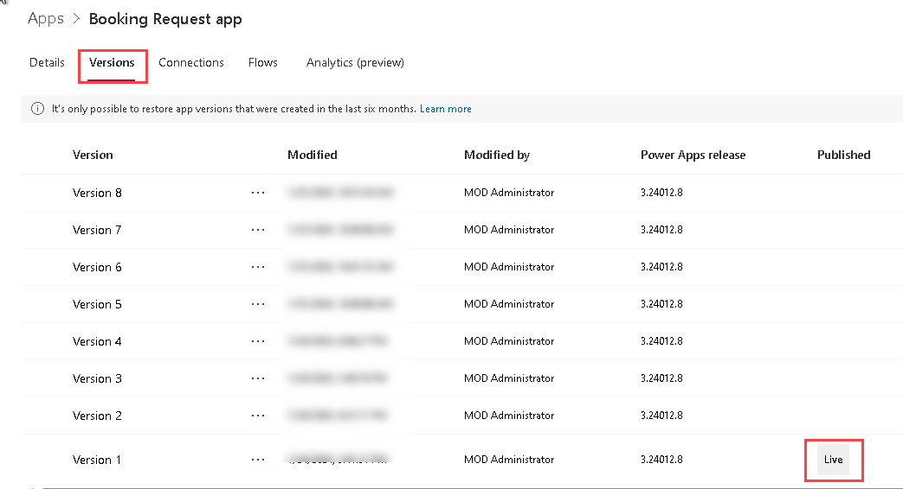
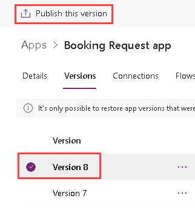
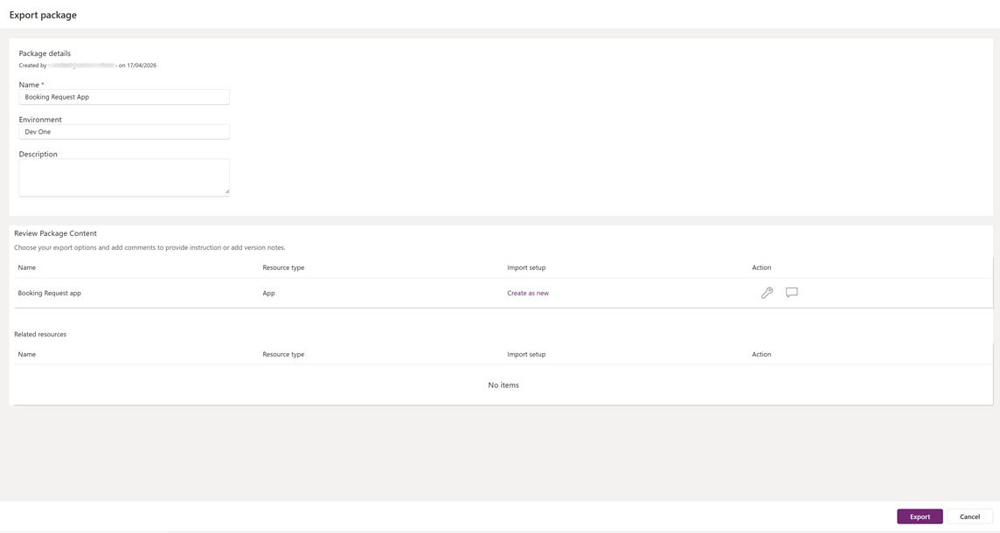

---
lab:
    title: 'Lab 7: Manage canvas apps'
    module: 'Module 7: Publish, share, and maintain a canvas app'
---

# Practice Lab 7 – Manage canvas apps

In this module you will manage your canvas app.

## What you will learn

- How to share canvas apps
- How to manage canvas apps versions
- How to publish canvas apps
- How to export canvas apps

## High-level lab steps

- Share a canvas app
- View canvas app versions
- Publish a canvas app
- Export a canvas app
  
## Prerequisites

- Must have completed **Lab 6: Forms**

## Detailed steps

## Exercise 1 – Manage

### Task 1.1 - Share the Booking Request app

1. Navigate to the Power Apps Maker portal <https://make.powerapps.com>.

1. Make sure you are in the **Dev One** environment.

1. Select the **Apps** tab from the left-side menu.

1. Select the **Booking Request app**, select the Commands (**...**), and select **Share**.

    

1. In the Share pane, enter `Everyone` annd select **Everyone in Contoso**.

    

1. Select **Share**.

1. **Close** the Share app pane.

### Task 1.2 - Publish the Booking Request app

1. Select the **Booking Request app**, select the Commands (**...**), and select **Details**.

1. Select the **Versions** tab.

    

1. Select the highest version.

    

1. Select **Publish this version**.

1. Select **Publish this version** again.

## Exercise 2 – Export

### Task 2.1 - Export the Booking Request app

1. Navigate to the Power Apps Maker portal <https://make.powerapps.com>.

1. Make sure you are in the **Dev One** environment.

1. Select the **Apps** tab from the left-side menu.

1. Select the **Booking Request app**, select the Commands (**...**), and select **Export package**.

    

1. Enter `Booking Request app` for Name

1. Select **Update** under **IMPORT SETUP**.

1. Select **Create as new** and select **Save**.

1. Select **Export**.

1. Wait for package to be created and downloaded. This creates a zip file in your Downloads folder.

### Task 2.2 - Save the app locally

1. Select the **Apps** tab from the left-side menu.

1. Select the **Booking Request app**, select the Commands (**...**), and select **Edit > Edit in new tab**.

1. Select the Select the drop-down caret next to **Save** in the top-right of the Power Apps Studio.

1. Select **Download a copy**.

1. Select **Download**.  This creates a msapp file in your Downloads folder.

1. Select the **<- Back** button from the top left of the command bar, and select **Leave** to exit the app.
